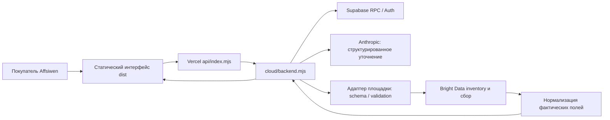

# Архитектура и карта кода

## Текущий путь

Ассистент интерпретирует задачу; сервер определяет допустимый контракт и пределы. Модель не распоряжается деньгами, не устанавливает цену и не вызывает произвольные платные инструменты. Визуальный продукт и страна/площадка не означают наличие любого режима поиска.

## Файлы

| Файл/папка | Назначение |
|---|---|
| dist/market.js, landing.js, landing.css, market.css | Маршрутизация, главная, кабинеты и UI |
| dist/commerce-catalog.js | 42 продукта, описания, источники, границы рынков, editorial Hot |
| dist/amazon.js | Универсальная продуктовая страница, диалог, фото, предложение, результат/CSV |
| api/index.mjs | Vercel entrypoint |
| cloud/backend.mjs | HTTP, CSRF/origin, cookies, Auth, RPC, продуктовые workspace/chat/run/export |
| server/amazon.mjs | Amazon inventory/schema, подготовка, Anthropic Messages/vision/structured reply |
| server/commerce.mjs | Выбор адаптера; E-commerce кроме Amazon |
| server/travel.mjs, finance.mjs, social.mjs, real-estate.mjs | Контракты и нормализация категорий |
| server/creators.mjs, creators-run.mjs | Единый согласованный бриф и составной поиск двух источников |
| server/amazon-run.mjs | Async runner, резервы, status/polling, безопасная выдача |
| server/economics.mjs, scripts/economics-report.mjs | Сценарии экономики поиска компаний, не фактическая прибыль |
| cloud/schema.sql, intake.sql, seed.sql, verify.sql | База, guarded RPC, временные диалоги, demo-каталог, проверки |
| scripts/build-cloud.mjs | Проверка синтаксиса UI и allowlist-копирование в public |
| scripts/prepare-public.mjs | Публичный cloud-release; не весь локальный checkout |
| tests/ | 191 проверка текущего полного рабочего снимка |
| server/http.mjs, store.mjs, market-store.mjs, providers.mjs | Исторический локальный Node/SQLite/Apify прототип |

## HTTP

Same-origin `/api/*` переписывается в `api/index.mjs?route=...`. Основные продуктовые маршруты:

- `/api/amazon/{connection,workspace,prepare,chat,chat/reset,demo,export,run,run/status}`.
- `/api/commerce/<id>/{connection,workspace,prepare,chat,chat/reset,demo,export,run,run/status}` для остальных продуктов.
- `GET /api/health`, `/api/catalog`, `/api/me`, `/api/orders`.
- Auth: `/api/auth/google/start`, `/api/auth/google/callback`; email sign-in/sign-up и сессии — cloud/backend.
- Marketplace: предложения партнёров, favorites, operations, order events/messages, demo pay-test/refund-test.

POST требует JSON, совпадающий Origin и `X-Affsiwen-Request: 1`. Документирование endpoint не отменяет проверку ownership/role. `demo` всегда синтетический; его выдачу не смешивать с `mode=live`.

## Данные и доступ

Приватная схема `affsiwen`: profiles, products, orders, events, messages, favorites, intake. Прямые табличные grants публичным клиентам закрыты, RLS включён. Публичные RPC wrappers — security invoker; внутренние guarded функции — security definer с пустым search_path и проверками роли/владельца или capability. Это требует отдельной DB-приёмки; обычного authenticated grant недостаточно.

Роль operator нельзя назначить через публичную регистрацию. Анонимные диалоги используют случайную 256-bit capability в HttpOnly/Secure/SameSite-cookie: `aff_amazon` или `aff_commerce_<id>`. В базе хранится hash, document, revision, expires. Запись проверяет expected_revision. Срок хранения/обновления — 1 день, до 1000 активных документов, до 50KB документ. Ключ cookie не даёт доступ к заказам других пользователей.

Это временный пилот, не долговечный ledger: expiry может удалить run/лимит; коммерческая модель должна вынести лимиты, исполнение и заказы в отдельные постоянные таблицы.

## Исполнение

1. Клиент подтверждает актуальный planId, который уже сохранён сервером.
2. Runner заново валидирует plan по live schema, не доверяет присланному contract.
3. HMAC-derived private run + revision admit одну trigger-попытку; общий дневной budget резервируется до POST.
4. Записывается starting, затем snapshot/running либо failed/unknown. Неизвестный исход не повторяется.
5. Только чтение progress/snapshot, с throttling и bounded response; ready/empty/failed сохраняются.
6. Нормализация оставляет неизвестные поля как «—», сохраняет нули, ограничивает текст и URL; CSV экранирует потенциальные формулы.

В пилоте max 10 records, одна input-строка, max 3 attempts/day для всех продуктов. Для Creator Shortlist два дочерних поиска и отдельный флаг; неполный второй источник не выдаётся за завершённый подбор. $0.25 reservation/попытку — оценка приложения, не гарантия invoice-cap.

## Известные риски архитектуры

- Run/budget namespace зависит от provider key; ротация требует сверки и миграции, иначе теряется связь с существующими run/резервами. AI allowance также keyed к Anthropic secret — ротация не должна сбрасывать фактический дневной лимит.
- Публичный pre-sale чат имеет общий потолок, но до масштабирования нужны per-user/per-IP ограничения и защита от расходования квоты.
- Нет собственного durable background worker/очереди: текущий polling инициируется интерфейсом. Продолжительные задания и коммерческий retry/reconciliation нужно проектировать отдельно.
- Работа Google/ролей/email и DB authorization проверяется на живой отдельной среде, не по mock-тестам.
- Старый generic health и некоторые ранние планы устарели относительно продуктового чата. Пользоваться этой передачей и датированными product checkpoints.
